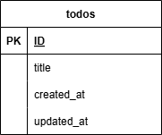

## アプリケーション名

TODOアプリ

## 環境構築

```
Dockerビルド
1. git clone <リポジトリURL>
2. dockerコンテナを構築
$ docker-compose up -d --build

3. srcディレクトリにある「.env.example」をコピーして 「.env」を作成し DBの設定を変更
$ cp .env.example .env
---
DB_HOST=mysql
DB_DATABASE=todo_db
DB_USERNAME=todo_user
DB_PASSWORD=todo_pass
---

Laravelをインストール
1. docker-compose exec php bash
2. composer install

アプリケーションキーを作成
3. php artisan key:generate

DBのテーブルを作成
4. php artisan migrate

DBのテーブルにダミーデータを投入
5. php artisan db:seed

"The stream or file could not be opened" エラーが発生した場合
ディレクトリ/ファイルの権限を変更
6. sudo chmod -R 777 src/storage

ストレージに保存したファイルを表示するためシンボリックリンクを作成
7. php artisan storage:link

Nuxt (フロント) を起動
8. docker-compose exec nuxt bash
9. npm install
10. npm run dev -- --host 0.0.0.0 --port 3000
```

## 使用技術

```
・PHP 8.0
・Laravel 10
・MySQL 8.0
・Node.js 20 (Nuxt 4 / Vue 3)
・Axios (HTTP通信)
```

## URL

```
・環境構築：http://localhost/
・Nuxt (フロント)： http://localhost:3000/
・Laravel API： http://localhost:8000/api/todos
・phpMyAdmin： http://localhost:8080/
```

## ER 図



